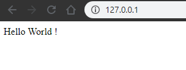

# Exemple de site statique HTML avec un Docker Compose

## Prérequis

- [Installation de Docker](../../../docs/installation/docker_install.html)
- Vérifier que Docker est lancé :

  ```shell
  # La commande suivante :
  $ docker -v

  # doit vous retourner :
  Docker version 19.03.5, build 633a0ea
  ```

> **ATTENTION**:
>
> Toutes les commandes `docker-compose ...` sont à exécuter dans le répertoire qui contient le fichier `docker-compose.yml`.

## Lancer le service

Pour démarrer le container depuis l'image créée, executer la commande suivante dans un terminal :

```shell
docker-compose up -d
```

Puis dans votre navigateur, entrer l'URL suivante : <http://localhost:80/>

Vous devriez voir :



## Arrêter votre service

Pour arrêter le service créé, exécuter la commande suivante dans un terminal :

```shell
docker-compose stop
```

Cette commande arrêtera les services définis dans le fichier `docker-compose.yml` du répertoire courant.

## Relancer votre service

Pour relancer le service créé, exécuter la commande suivante dans un terminal :

```shell
docker-compose start
```

Cette commande relancera les services définis dans le fichier `docker-compose.yml` du répertoire courant.

## Arrêter et nettoyer votre service

Pour arrêter et nettoyer le service créé, exécuter la commande suivante dans un terminal :

```shell
docker-compose down
```

Cette commande arrêtera les services définis dans le fichier docker-compose.yml du répertoire courant puis supprimera les containers et network associés.

## Supprimer les containers liés aux services lancés

Une fois les services arrêtés via la commade `docker-compose stop`, vous pouvez supprimer les containers associés via la commande suivante :

```shell
docker-compose rm
```

## Arrêter brutalement les services

Il peut arriver que la commande Stop ne fonctionne pas. Pour forcer l'arrêt des services, exécuter la commande suivante :

```shell
docker-compose kill
```

## Corriger les erreurs

Si vous voyez ce message lorsque vous essayer de démarrer votre service :

```shell
$ docker-compose up -d
Creating network "1-static-site_default" with the default driver
Creating web-nginx ... error

ERROR: for web-nginx  Cannot start service web-nginx: error while creating mount source path './docker-workshop/code/docker-compose/1-static-site/docker-web/nginx.conf': mkdir ./docker-workshop/code/docker-compose/1-static-site/docker-web/nginx.conf: file exists

ERROR: for web-nginx  Cannot start service web-nginx: error while creating mount source path './docker-workshop/code/docker-compose/1-static-site/docker-web/nginx.conf': mkdir ./docker-workshop/code/docker-compose/1-static-site/docker-web/nginx.conf: file exists
Encountered errors while bringing up the project.
```

Lancer la commande suivante dans un terminal :

```shell
docker container prune
```
