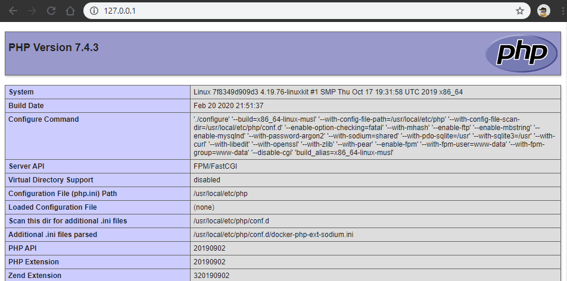

# Exemple de site statique PHP avec un Docker Compose

## Lancer le service

Pour démarrer les containers depuis l'image créée, executer la commande suivante dans un terminal :

```shell
docker-compose up -d
```

Puis dans votre navigateur, entrer l'URL suivante : <http://localhost:80/>

Vous devriez voir :



## Arrêter votre service

Pour arrêter le service crée, exécuter la commande suivante dans un terminal :

```shell
docker-compose stop
```

Cette commande arrêtera les services défini dans le fichier docker-compose.yml du répertoire courant.

## Arrêter et nettoyer votre service

Pour arrêter le service crée, exécuter la commande suivante dans un terminal :

```shell
docker-compose down
```

Cette commande arrêtera les services défini dans le fichier docker-compose.yml du répertoire courant puis supprimera les containers et network associés.

## Supprimer les containers liés aux services lancés

Une fois les services arrêtés, vous pouvez supprimer les containers associés via la commande suivante :

```shell
docker-compose rm
```

## Arrêter brutalement les services

Il peut arriver que la commande Stop ne fonctionne pas. Pour forcer l'arrêt des services, exécuter la commande suivante :

```shell
docker-compose kill
```