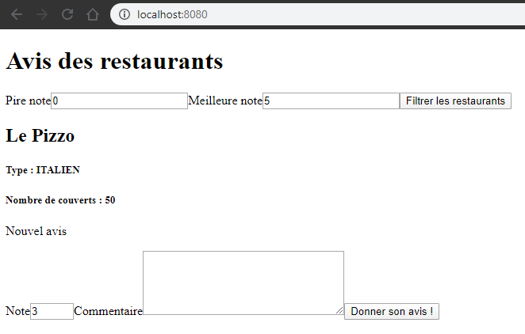

# Exemple de Projet Spring / Angular / H2

## Prérequis

- [Installation de Docker](../../../docs/installation/docker_install.html)
- Vérifier que Docker est lancé :

  ```shell
  # La commande suivante :
  $ docker -v

  # doit vous retourner :
  Docker version 19.03.5, build 633a0ea
  ```

> **ATTENTION**:
>
> Toutes les commandes `docker-compose ...` sont à exécuter dans le répertoire qui contient le fichier `docker-compose.yml`.

## Construire les services

Pour construire les images depuis le `docker-compose.yml`, executer la commande suivante dans un terminal :

```shell
docker-compose build
```

## Lancer le service

Pour démarrer les containers depuis l'image créée, executer la commande suivante dans un terminal :

```shell
docker-compose up -d
```

Puis dans votre navigateur, entrer l'URL suivante : <http://localhost:8080/>

Vous devriez voir :



## Visualiser les Logs

Pour visualiser les logs en continue, exécuter la commande suivante dans un terminal :

```shell
docker-compose logs -f
```

Cette commande fera défiler les logs en continue. Pour sortir de cette commande :

```shell
CTRL + C
```

## Arrêter votre service

Pour arrêter le service créé, exécuter la commande suivante dans un terminal :

```shell
docker-compose stop
```

Cette commande arrêtera les services définis dans le fichier `docker-compose.yml` du répertoire courant.

## Relancer votre service

Pour relancer le service créé, exécuter la commande suivante dans un terminal :

```shell
docker-compose start
```

Cette commande relancera les services définis dans le fichier `docker-compose.yml` du répertoire courant.

## Arrêter et nettoyer votre service

Pour arrêter et nettoyer le service créé, exécuter la commande suivante dans un terminal :

```shell
docker-compose down
```

Cette commande arrêtera les services définis dans le fichier docker-compose.yml du répertoire courant puis supprimera les containers et network associés.

## Supprimer les containers liés aux services lancés

Une fois les services arrêtés via la commade `docker-compose stop`, vous pouvez supprimer les containers associés via la commande suivante :

```shell
docker-compose rm
```

## Arrêter brutalement les services

Il peut arriver que la commande Stop ne fonctionne pas. Pour forcer l'arrêt des services, exécuter la commande suivante :

```shell
docker-compose kill
```

## Sources

Remerciements à Jules pour ces sources :

- [API](https://github.com/jlsgrand/restaurant-api)
- [Front](https://stackblitz.com/edit/jlsgrand-restaurant-review)

### Liens

- [Exemple de Dockerisation d'un projet Angular](https://malcoded.com/posts/angular-docker/)
- [Exemple de Dockerisation d'un projet Spring boot](https://dzone.com/articles/build-package-and-run-spring-boot-apps-with-docker)