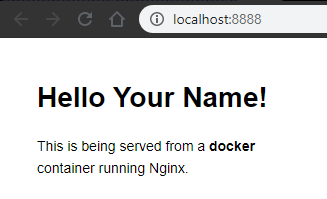

# Exemple de site statique avec un Dockerfile

## Prérequis

- [Installation de Docker](../../../docs/installation/docker_install.html)
- Vérifier que Docker est lancé :

  ```shell
  # La commande suivante :
  $ docker -v

  # doit vous retourner :
  Docker version 19.03.5, build 633a0ea
  ```

## Construire l'image

Pour construire l'image depuis le fichier Dockerfile, executez la commande suivante :

```shell
# Construction de l'image
$ docker build -t dockerfiles/static-site:latest .
```

Cette commande construira une image nommée `dockerfiles/static-site` depuis le fichier Dockerfile situé dans le répertoire `.` (ici le répertoire courant) en lui affectant le tag `latest`.

## Vérifier l'image créée

Dans un terminal, executer la commande suivante :

```shell
# Lister les images locales
$ docker image ls
```

Vous deriez voir l'image `dockerfiles/static-site` :

```shell
$ docker image ls
REPOSITORY                 TAG                 IMAGE ID            CREATED             SIZE
...
dockerfiles/static-site    latest              c33537990c28        20 hours ago        127MB
...
```

## Lancer l'image

Pour démarrer le container depuis l'image créée, executer la commande suivante dans un terminal :

```shell
docker run --name static-site -e AUTHOR="Your Name" -d -p 8888:80 dockerfiles/static-site
```

Puis dans votre navigateur, entrer l'URL suivante : <http://localhost:8888/>

Vous devriez voir :



## Arrêter le container

Pour arrêter le container depuis l'image créée, executer la commande suivante dans un terminal :

```shell
docker stop static-site
```
